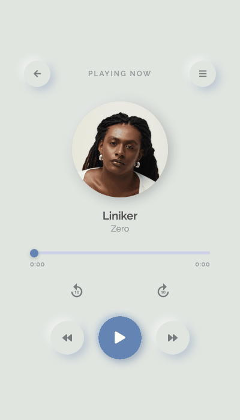
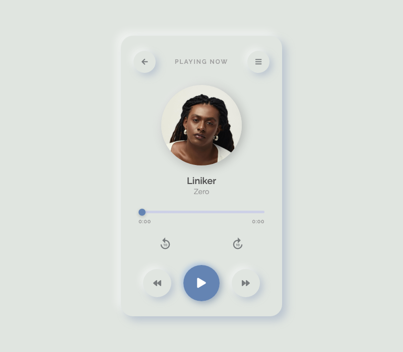
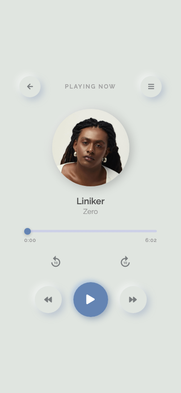

<div align="center">

# Music Player

### Player de música com design neumorfismo — desenvolvido com HTML, CSS e JavaScript puro

[](https://developer.mozilla.org/pt-BR/docs/Web/HTML)
[](https://developer.mozilla.org/pt-BR/docs/Web/CSS)
[](https://developer.mozilla.org/pt-BR/docs/Web/JavaScript)

</div>

---

## Sobre o Projeto

**Music Player** é um player de música web com identidade visual baseada em **neumorfismo** — estilo de design que simula superfícies tridimensionais com sombras suaves. O player controla uma faixa de áudio completa com interface responsiva para desktop e mobile, construído inteiramente com tecnologias web puras, sem frameworks ou bibliotecas de UI.

---

## Demo

<div align="center">



</div>

---

## Funcionalidades

- **Play / Pause** — controle de reprodução com ícone animado
- - **Barra de progresso clicável** — arraste ou clique para pular para qualquer ponto da música
  - - **Timer** — exibe tempo atual e duração total calculados automaticamente
    - - **Avançar / Voltar 10s** — botões de skip rápido para navegação precisa
      - - **Capa giratória** — a capa do álbum gira durante a reprodução e pausa ao pausar
        - - **Reset automático** — ao terminar a música, o player volta ao início automaticamente
          - - **Design neumorfismo** — sombras, relevos e transições suaves
            - - **Layout responsivo** — adaptado para desktop e mobile
             
              - ---

              ## Tecnologias

              - **HTML5 + Audio API** — estrutura e controle nativo de áudio
              - - **CSS3** — neumorfismo com Flexbox e animações customizadas
                - - **JavaScript Vanilla** — lógica do player sem dependências
                  - - **Font Awesome** — ícones de play, pause e controles
                    - - **Material Icons** — botões de skip
                      - - **Google Fonts (Raleway)** — tipografia
                       
                        - ---

                        ## Como Rodar

                        Basta abrir o `index.html` no navegador — nenhuma instalação necessária.

                        ```shell
                        git clone https://github.com/GeozedequeGuimaraes/music-player.git
                        cd music-player
                        open index.html
                        ```

                        ---

                        ## Estrutura

                        ```
                        music-player/
                        ├── index.html        ← estrutura do player
                        ├── style.css         ← estilos neumorfismo e responsividade
                        ├── index.js          ← lógica de controle do áudio
                        ├── files/
                        │   ├── liniker.jpg   ← capa do álbum
                        │   └── liniker_zero.mp3 ← faixa de áudio
                        └── screenshots/      ← imagens para o README
                        ```

                        ---

                        ## Screenshots

                        <div align="center">

                        | Desktop | Mobile |
                        |:---:|:---:|
                        |  |  |

                        </div>

                        ---

                        ## Autor

                        <div align="center">

                        **Geozedeque Guimarães**
                        Estudante de Ciência da Computação — CIn-UFPE

                        [](https://github.com/GeozedequeGuimaraes)
                        [](https://linkedin.com/in/geozedeque-guimaraes)

                        </div>
